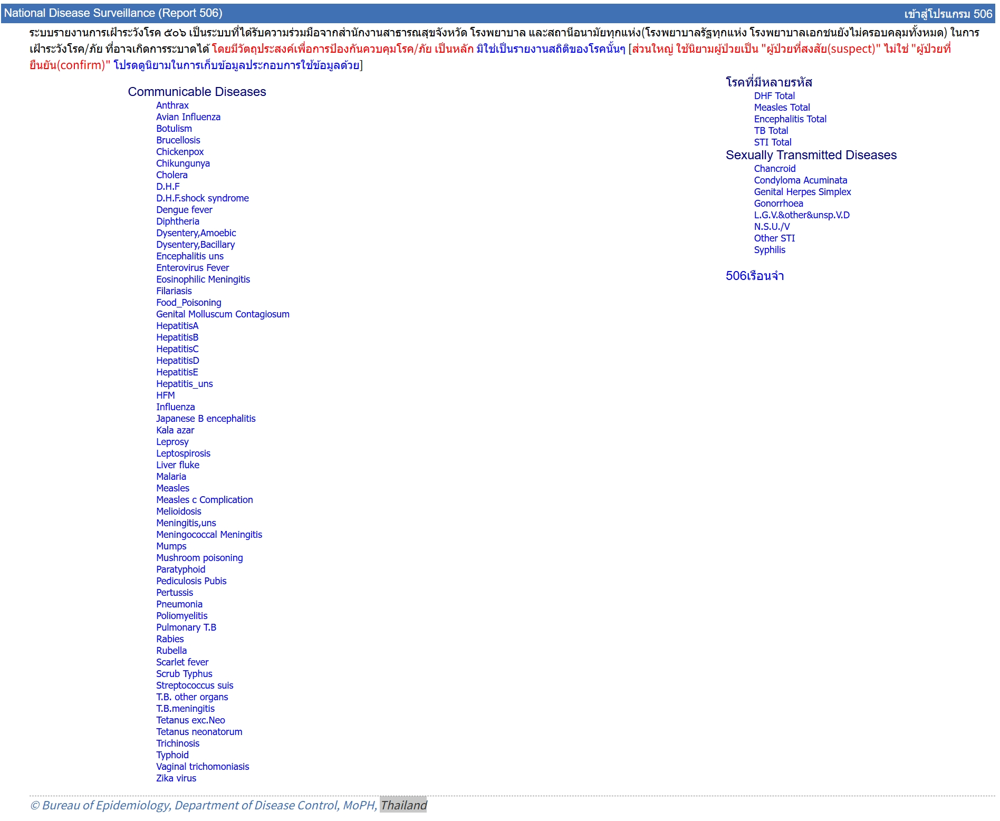
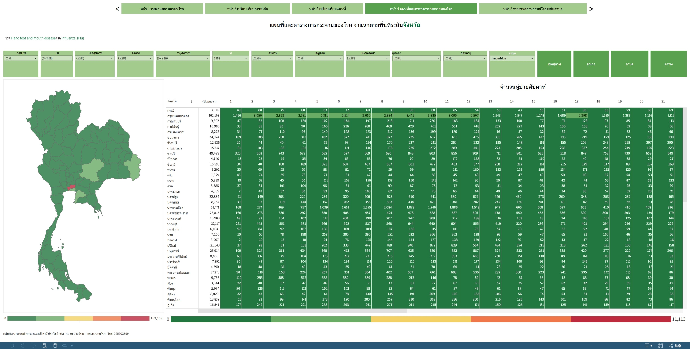

# Introduction

This folder contains infectious disease data for Thailand from 2008 to the present, sourced from the Bureau of Epidemiology, Ministry of Public Health, Thailand. The data includes monthly records from 2008 to 2024 and weekly records from 2025 onwards.

## Requirements

- Python 3.12.3
- R >= 4.3.2
- pip 21.1.2
- Joinpoint CMD 5200: [Application for Windows Batch/Callable Version of Joinpoint Regression Software](https://surveillance.cancer.gov/joinpoint/callable/)

## Calendar of updates

| Buddhist year in Thailand | Gregorian year |
| --- | --- |
| 2551 | 2008 |
| 2552 | 2009 |
| 2553 | 2010 |
| 2554 | 2011 |
| 2555 | 2012 |
| 2556 | 2013 |
| 2557 | 2014 |
| 2558 | 2015 |
| 2559 | 2016 |
| 2560 | 2017 |
| 2561 | 2018 |
| 2562 | 2019 |
| 2563 | 2020 |
| 2564 | 2021 |
| 2565 | 2022 |
| 2566 | 2023 |
| 2567 | 2024 |
| 2568 | 2025 |


## Health zones in Thailand, 2024

| Health Zone | Provinces Included |
| --- | --- |
| Zone 1 | Chiang Mai, Chiang Rai, Lamphun, Lampang, Mae Hong Son, Nan, Phayao, Phrae |
| Zone 2 | Phitsanulok, Phetchabun, Sukhothai, Tak, Uttaradit |
| Zone 3 | Chai Nat, Kamphaeng Phet, Phichit, Nakhon Sawan, Uthai Thani |
| Zone 4 | Ang Thong, Lop Buri, Nakhon Nayok, Nonthaburi, P.Nakhon S.Ayutthaya, Pathum Thani, Saraburi, Sing Buri |
| Zone 5 | Kanchanaburi, Nakhon Pathom, Phetchaburi, Ratchaburi, Prachuap Khiri Khan, Ratchaburi, Samut Sakhon, Samut Songkhram, Suphan Buri |
| Zone 6 | Chachoengsao, Chanthaburi, Chon Buri, Prachin Buri, Rayong, Sa Kaeo, Samut Prakan, Trat |
| Zone 7 | Kalasin, Khon Kaen, Maha Sarakham, Roi Et |
| Zone 8 | Bungkan, Loei, Nakhon Phanom, Nong Bua Lam Phu, Nong Khai, Sakon Nakhon, Udon Thani |
| Zone 9 | Buri Ram, Chaiyaphum, Surin, Nakhon Ratchasima, Surin |
| Zone 10 | Amnat Charoen, Mukdahan, Si Sa Ket, Ubon Ratchathani, Yasothon |
| Zone 11 | Chumphon, Krabi, Nakhon Si Thammarat, Phangnga, Phuket, Ranong, Surat Thani |
| Zone 12 | Narathiwat, Pattani, Phatthalung, Satun, Songkhla, Yala |
| Zone 13 | Bangkok |

# Data

All data files are stored in the `Data` folder.

## Data Description

Dashboard list: [Dashboard list](https://doe.moph.go.th/app01/?page_id=764)

### From 2008 to 2024: monthly infectious disease data in Thailand

Data Source: [Bureau of Epidemiology, Ministry of Public Health, Thailand](https://doe1.moph.go.th/surdata/index.php).



Files available for download from the Bureau of Epidemiology website are in RTF format.

| Raw file name | Cleaned file name | File Description                                             |
| --- | --- | --- |
| mcd_disease_xx.rtf | disease_mcd.csv | Number of cases and deaths by month and province |
| rate_disease_xx.rtf | disease_rate.csv | Number and rate per 100,000 population of cases and deaths by province |
| ac_disease_xx.rtf | disease_ac.csv | Number of infections: Number of cases by age grouped and province |
| ad_disease_xx.rtf | disease_ad.csv | Number of deaths: Number of deaths by age grouped and province |
| race_disease_xx.rtf | Not cleaned | Number of cases and deaths: Number of cases and deaths by nationality and province|
| c_occ_disease_xx.rtf | Not cleaned | Number of patients: Number of cases by occupation |
| d_occ_disease_xx.rtf | Not cleaned | Number of deaths: Number of deaths by occupation |

### From 2020 onwards: weekly infectious disease data in Thailand

Data Source: 

[Bureau of Epidemiology, Ministry of Public Health, Thailand](https://dvis3.ddc.moph.go.th/t/DDC_CENTER_DOE/views/priority_v2/Dashboard2?%3Aembed=y&%3AisGuestRedirectFromVizportal=y).

[Dashboard table](https://dvis3.ddc.moph.go.th/t/DDC_CENTER_DOE/views/DDS2/Dashboard_table?%3Aembed=y&%3AisGuestRedirectFromVizportal=y)



## Data collection scripts

Data collection scripts are in the `ScriptGetdata` folder. The main script is `GetNewData.py` and `GetData.py`, which collect data from the above two sources respectively.

### Monthly data source (2008-2024)

```python
## Sync data status from monthly data source (2008-2024)
python3 ID_TH/ScriptGetdata/SyncData.py

## Get data from monthly data source (2008-2024)
python3 ID_TH/ScriptGetdata/GetData.py
```

### Weekly data source (2025 onwards)

The refactored `WeeklyCasesData.py` supports multiprocessing for significantly faster data extraction. Key improvements include:

- **Function Modularization**: Common functions moved to `GetNewDataFunction.py`
  - `extract_split_domains_from_filters()`: Extract filter domain values
  - `fetch_other_worksheet_after_server_filters()`: Apply filters and fetch target worksheet
  
- **Pre-generate Task List**: Fetch all metadata (parameters, worksheets, filters) first, then generate complete task list
  - **Parallel Execution**: Uses Python `multiprocessing.Pool` to process all tasks in parallel
  - **Worker Function**: `process_single_task()` handles individual extraction tasks

- **Progress Bar**: Real-time progress display using `tqdm` (optional)
- **Silent Mode**: Reduced repetitive console output, metadata shown only at start
- **Log Level Control**: Detailed info logged to file, console shows only critical messages
- **Result Summary**: Display success/failure statistics upon completion

### Workflow

```text
1. Fetch dashboard metadata
   ├─ Load workbook and worksheet
   ├─ Extract parameters (year parameter)
   └─ Get filters metadata

2. Generate task list
   ├─ Iterate through all years
   ├─ Extract split-by dimension domain values
   ├─ Generate Cartesian product combinations
   └─ Create task dictionary for each combination

3. Parallel execution
   ├─ Use multiprocessing.Pool
   ├─ Each worker loads worksheet independently
   ├─ Apply filters and extract data
   └─ Save to CSV

4. Collect results
   └─ Aggregate all task results and log
```

### Usage

#### Basic Usage (single-process, backward compatible)

Total cases in 2025, split by disease (`โรค`), based on reporting date:

```bash
python ID_TH/ScriptGetdata/WeeklyCasesData.py \
  --years 2568 \
  --split-by 'โรค' \
  --indices 'จำนวนผู้ป่วย' \
  --output-dir ID_TH/Data/WeeklyCasesData \
  --workers 1
```

#### Multiprocessing (recommended)

Auto-use all CPU cores for faster extraction:

```bash
# Auto-use all CPU cores
python ID_TH/ScriptGetdata/WeeklyCasesData.py \
  --years 2568 \
  --split-by 'โรค' \
  --indices 'จำนวนผู้ป่วย' \
  --output-dir ID_TH/Data/WeeklyCasesData \
  --workers 0
```

Total cases in 2025, split by disease (`โรค`), using multiple worker processes:

```bash
# Use 8 workers
python ID_TH/ScriptGetdata/WeeklyCasesData.py \
  --years 2568 \
  --split-by 'โรค' \
  --indices 'จำนวนผู้ป่วย' \
  --output-dir ID_TH/Data/WeeklyCasesData \
  --workers 8
```

Total deaths in 2025, split by disease (`โรค`), using multiple worker processes:

```bash
# Use 8 workers
python ID_TH/ScriptGetdata/WeeklyCasesData.py \
  --years 2568 \
  --split-by 'โรค' \
  --indices 'จำนวนผู้เสียชีวิต' \
  --output-dir ID_TH/Data/WeeklyDeathsData \
  --workers 8
```

#### Multi-year Split

Total cases split by disease (`โรค`) for multiple years:

```bash
# Split one dimension (disease), use 20 workers
python ID_TH/ScriptGetdata/WeeklyCasesData.py \
  --years 2563,2564,2565,2566,2567,2568 \
  --split-by 'โรค' \
  --indices 'จำนวนผู้ป่วย' \
  --output-dir ID_TH/Data/WeeklyCasesData \
  --workers 0
```

Total deaths split by disease (`โรค`) for multiple years:

```bash
# Split one dimension (disease), use 20 workers
python ID_TH/ScriptGetdata/WeeklyCasesData.py \
  --years 2563,2564,2565,2566,2567,2568 \
  --split-by 'โรค' \
  --indices 'จำนวนผู้เสียชีวิต' \
  --output-dir ID_TH/Data/WeeklyDeathsData \
  --workers 0
```

#### Multi-year + Multi-age Split

Total cases split by disease (`โรค`) and age group (`กลุ่มอายุ`) for multiple years:

```bash
# Split two dimensions (disease × age group), use 20 workers
python ID_TH/ScriptGetdata/WeeklyCasesData.py \
  --years 2563,2564,2565,2566,2567,2568 \
  --split-by 'โรค' \
  --split-by 'กลุ่มอายุ' \
  --indices 'จำนวนผู้ป่วย' \
  --output-dir ID_TH/Data/WeeklyCasesData \
  --workers 0
```

Total deaths split by disease (`โรค`) and age group (`กลุ่มอายุ`) for multiple years:

```bash
# Split two dimensions (disease × age group), use 20 workers
python ID_TH/ScriptGetdata/WeeklyCasesData.py \
  --years 2563,2564,2565,2566,2567,2568 \
  --split-by 'โรค' \
  --split-by 'กลุ่มอายุ' \
  --indices 'จำนวนผู้เสียชีวิต' \
  --output-dir ID_TH/Data/WeeklyDeathsData \
  --workers 20
```

#### Resume Interrupted Downloads

```bash
# Skip already downloaded files to resume interrupted work
python ID_TH/ScriptGetdata/WeeklyCasesData.py \
  --worksheet-name 'แผนที่ระดับจังหวัด' \
  --years 2566,2565,2564,2563 \
  --split-by 'โรค' \
  --also-fetch 'ตารางการกระจายผู้ป่วยจังหวัด' \
  --output-dir ID_TH/Data/WeeklyDeathsData \
  --workers 20 \
  --no-overwrite
```

## Parameters

| Parameter | Type | Default | Description |
|-----------|------|---------|-------------|
| `--url` | str | "https://dvis3.ddc.moph.go.th/t/DDC_CENTER_DOE/views/DDS2/sheet127?%3Aembed=y&%3AisGuestRedirectFromVizportal=y" | Tableau dashboard URL. Can be set via CLI `--url` overrides env var. |
| `--workers` | int | 1 | Number of worker processes. `0` or `-1` uses all CPU cores |
| `--worksheet-name` | str | `แผนที่ระดับจังหวัด` | Map worksheet name (default changed to `แผนที่ระดับจังหวัด`) |
| `--years` | str | - | Year list, comma-separated or repeated parameter (ปี) |
| `--indices` | str | - | Indicator/index list, comma-separated or repeatable (e.g., `ลักษณะข้อมูล` values such as 'จำนวนผู้ป่วย', 'จำนวนผู้เสียชีวิต', 'อัตราป่วยต่อประชากรแสนคน', 'อัตราตายต่อประชากรแสนคน', 'อัตราป่วยตาย(%)') |
| `--split-by` | str | - | Split dimension (repeatable), e.g., `โรค`, `กลุ่มอายุ` |
| `--also-fetch` | str | `['ตารางการกระจายผู้ป่วยจังหวัด']` | Target worksheet name(s) to fetch after filters (default: ตารางการกระจายผู้ป่วยจังหวัด) |
| `--global-filter` | str | - | Global filter to apply to all tasks (format: `field=value`, repeatable) |
| `--default-global-filter` | flag | False | Apply default global filter `วัน/สถานที่=ตามวันและสถานที่รายงาน` (disabled by default) |
| `--output-dir` | str | `Data/WeeklyCasesData` | Output directory |
| `--no-overwrite` | flag | False | Skip files that already exist (default: overwrite existing files) |

## Notes

1. **Memory Usage**: Each worker loads an independent worksheet; more workers = more memory
2. **Network Limits**: Too many concurrent requests may trigger server throttling; start with 4-8 workers
3. **Logging**: All workers share one log file; log entries may be interleaved
4. **Error Handling**: Single task failure won't affect other tasks; errors recorded in results

## Example Output

### Console Output (concise mode)

```text
Fetching dashboard metadata...
Global filters: [('วัน/สถานที่', 'ตามวันและสถานที่รายงาน')]
Available worksheets:
  [0] ชื่อโรคการกระจาย
  [1] ตารางการกระจายผู้ป่วยจังหวัด
  [2] แผนที่ระดับจังหวัด
Processing worksheet: แผนที่ระดับจังหวัด
Processing years: ['2563', '2564', '2565', '2566', '2567', '2568'] with 20 worker(s)...

============================================================
Data collection complete!
  Total tasks: 56
  Successful: 56
  Failed: 0
  Total rows: 221,200
============================================================
```

# To do list

- [ ] Fixed 0 cases of scarlat fever, TB, EM and Trichomoniasis in 2024
- [ ] Collect TB data from new weekly data source (2025 onwards)
- [ ] Transition from weekly data to monthly data aggregation
- [ ] Add cross-validation for time series model selection
